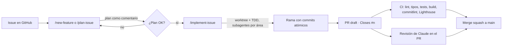

# Flujo de desarrollo asistido por IA

Este repositorio usa Claude Code como parte del proceso de ingeniería, con GitHub como fuente de verdad. Todo está versionado en `.claude/` y `.github/`.

## Principios

1. **Humano en el bucle.** La IA planifica y propone; las acciones externas (push, PR, cierre de issues) las decide la persona.
2. **TDD estricto.** Red → green → refactor, un commit por tarea.
3. **Aislamiento.** Cada issue se implementa en un `git worktree`; las áreas independientes se reparten entre subagentes en paralelo y se integran con `merge --no-ff`.
4. **Calidad automatizada.** Husky + commitlint en local; CI y Lighthouse en el PR.
5. **Documentación viva.** context7 mantiene a la IA al día con las APIs de las librerías.
6. **Sin secretos en el repo.** Valores reales solo en `.claude/settings.local.json`, `.env` o *GitHub Secrets*.

## Piezas

| Pieza | Ubicación |
| ----- | --------- |
| Comando `/commit` | `.claude/commands/commit.md` |
| Skills | `.claude/skills/*/SKILL.md` |
| Agentes | `.claude/agents/*.md` |
| Permisos | `.claude/settings.json` |
| MCP | `.mcp.json` |
| CI/CD | `.github/workflows/` |
| Planes generados | `docs/plans/` |

## Puesta en marcha

1. `gh auth login` y `gh auth status`.
2. `npm ci` (activa Husky con `prepare`).
3. Secreto `ANTHROPIC_API_KEY` en GitHub para el workflow de Claude.
4. `bash scripts/seed-issues.sh` para crear etiquetas e issues iniciales.
