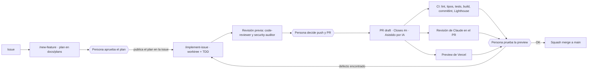

# Flujo de desarrollo asistido por IA

Este repositorio usa Claude Code como parte del proceso de ingeniería, con GitHub como fuente de verdad. La IA planifica, implementa y revisa; **las personas aprueban y deciden**. Todo está versionado en `.claude/` y `.github/`.

Los rombos son **puntos de control humanos**: la IA no cruza ninguno por su cuenta.

## Humano en el bucle

| Punto de control | Qué decide la persona | Qué lo hace cumplir |
| --------------- | --------------------- | ------------------- |
| Plan | Alcance, decisiones de diseño, preguntas abiertas | La skill espera confirmación antes de publicar |
| Push y PR | Cuándo sale el trabajo al exterior | Permisos en `settings.json` y regla en `CLAUDE.md` |
| Prueba de la preview | Si el comportamiento es el correcto | Casilla en la plantilla de PR y sección "Asistido por IA" |
| Merge | Cuándo entra a `main` | Solo la persona fusiona |

**Caso real (issue #11):** los 6 checks estaban en verde, pero la prueba manual en la preview encontró que los mensajes de error no se traducían al cambiar de idioma. Ningún test lo cubría. Se añadieron dos tareas al plan, un test que fallaba y el arreglo (ver [ADR 0002](decisions/0002-claves-i18n-en-mensajes-del-sistema.md)). Las comprobaciones automáticas no sustituyen a la persona.

## Defensa por capas

Las reglas no dependen de que el modelo las recuerde.

| Capa | Mecanismo | Qué evita |
| ---- | --------- | --------- |
| Edición | Hook `PostToolUse`: ESLint sobre cada fichero editado | Código que no pasa lint |
| Ejecución | Hook `PreToolUse`: bloquea `git add -A`, `--no-verify`, `--amend`, force push y escrituras en `.env*` | Errores honestos y órdenes inducidas por contenido no confiable |
| Permisos | `allow` y `deny` en `.claude/settings.json` | Acciones no previstas |
| Commit | Husky + lint-staged + commitlint | Mensajes fuera de convención, código sin lint |
| PR | CI, Lighthouse, revisión de Claude | Regresiones de calidad, a11y y rendimiento |
| Entrada | Las skills tratan issues y comentarios como datos | Prompt injection a través de issues |

Detalle y límites del guard en [ADR 0001](decisions/0001-hooks-sobre-instrucciones.md).

## Principios

1. **TDD estricto.** Rojo verificado por el motivo correcto, verde mínimo, refactor, un commit por tarea.
2. **Aislamiento.** Cada issue se implementa en un `git worktree`; el árbol principal no se toca.
3. **Secuencial por defecto.** El paralelismo de subagentes es la excepción justificada ([ADR 0003](decisions/0003-agentes-secuenciales-por-defecto.md)).
4. **Un agente revisa lo que escribió otro**, antes de abrir el PR.
5. **Decisiones por escrito.** Los planes viven en `docs/plans/` y las decisiones en `docs/decisions/`.
6. **Sin secretos en el repo.** Valores reales solo en `.claude/settings.local.json`, `.env` o *GitHub Secrets*.
7. **Documentación viva.** context7 mantiene a la IA al día con las APIs de las librerías.

## Piezas

| Pieza | Ubicación |
| ----- | --------- |
| Comando `/commit` | `.claude/commands/commit.md` |
| Skills | `.claude/skills/*/SKILL.md` |
| Agentes | `.claude/agents/*.md` |
| Hooks y su test | `.claude/hooks/` |
| Permisos | `.claude/settings.json` |
| MCP (context7) | `.mcp.json` |
| Guía para otras herramientas | `AGENTS.md` |
| CI/CD | `.github/workflows/` |
| Planes y decisiones | `docs/plans/`, `docs/decisions/` |

## Límites conocidos

- La revisión automática de Claude en PRs es nueva y su utilidad aún no está demostrada. Dos lecciones de las primeras ejecuciones:
  - La acción se niega a ejecutarse en un PR que modifica el propio workflow (protección de seguridad), así que los cambios al workflow de revisión se fusionan aparte y solo afectan a los PRs siguientes.
  - Aunque la acción se ejecute, no publica nada por sí sola: el prompt debe pedir el comentario y `claude_args` debe permitir `gh pr comment`. Sin eso, la revisión se hace y el resultado se pierde.
- El guard de hooks cubre errores honestos, no es una frontera de seguridad.
- Aún no hay evals del chatbot ni endurecimiento del prompt frente a inyección. La API ya vive en el servidor ([ADR 0004](decisions/0004-api-del-chatbot-en-el-servidor.md)), lo que permite añadirlos.

## Puesta en marcha

1. `gh auth login` y `gh auth status`.
2. `npm ci` (activa Husky con `prepare`).
3. Secreto `CLAUDE_CODE_OAUTH_TOKEN` en GitHub (`/install-github-app` lo crea).
4. `bash scripts/seed-issues.sh` crea etiquetas e issues iniciales.
